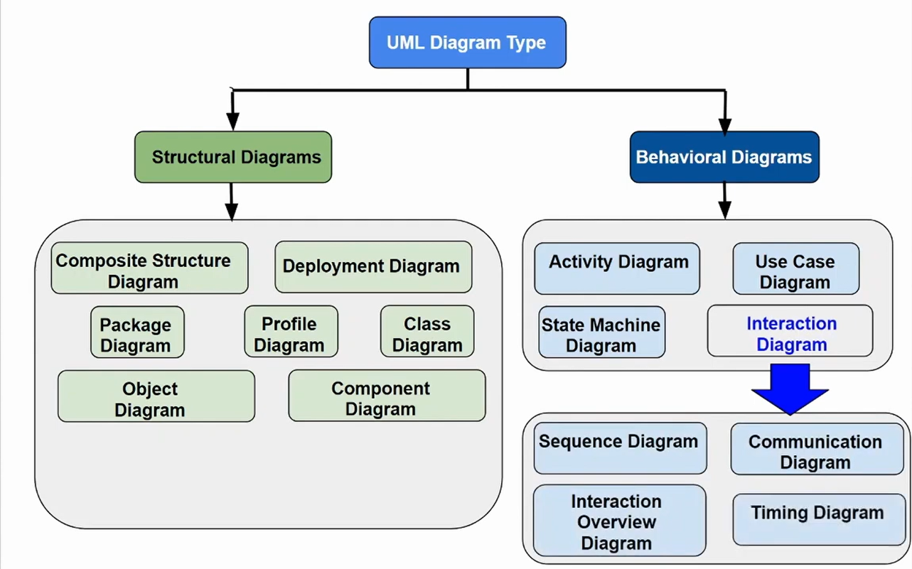
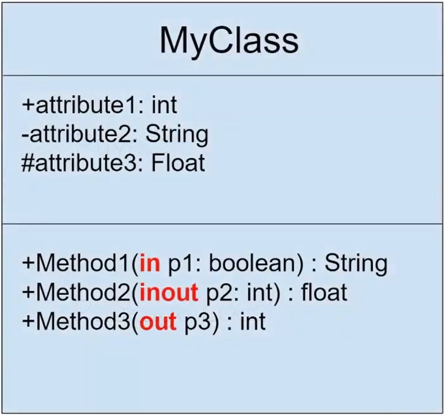
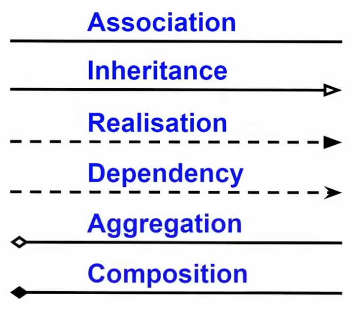
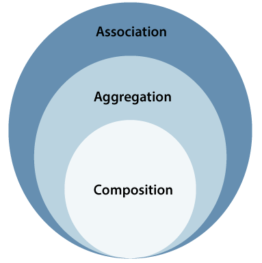
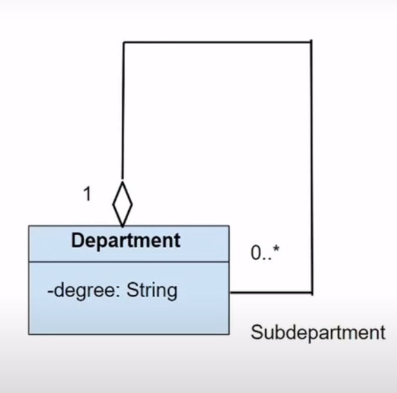
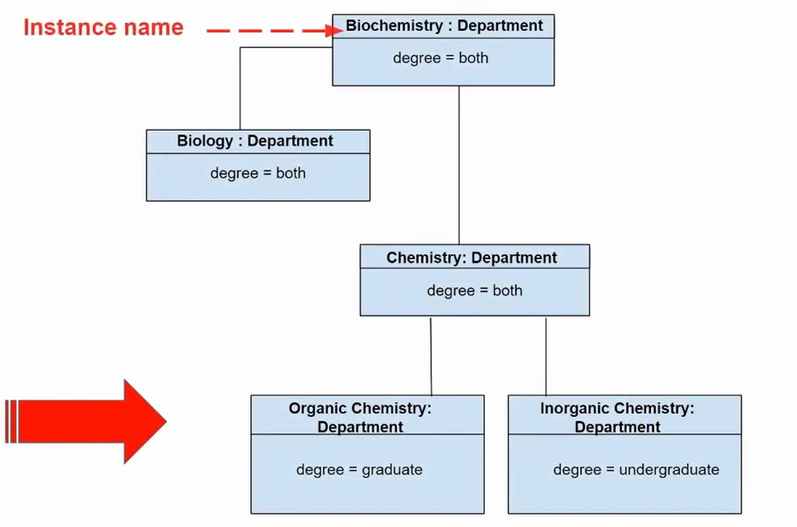
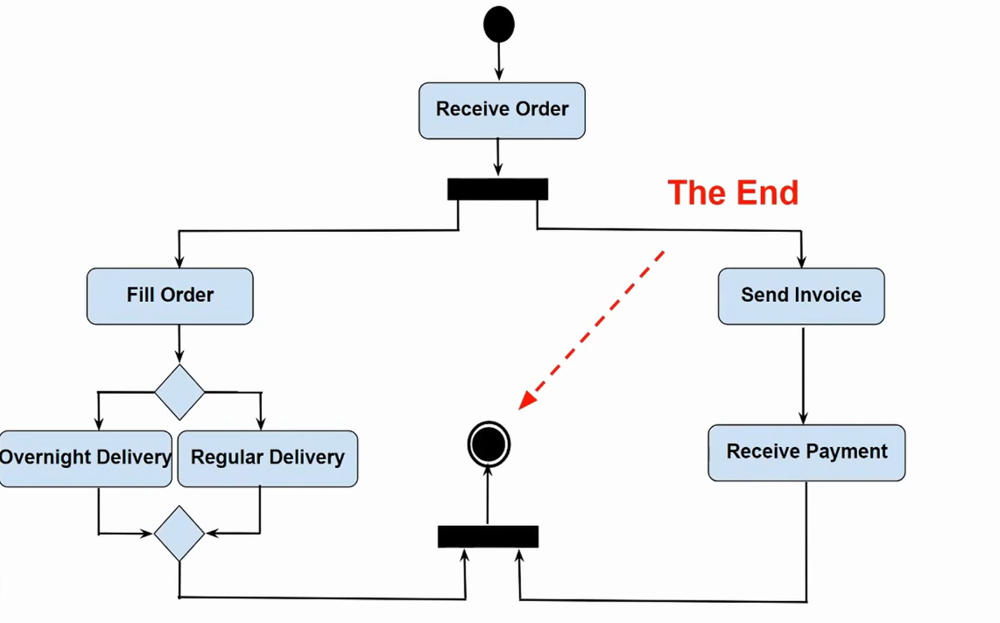

time line
most widely used diagrams and theirs basic notation and applications with practical example of system that UML model
## Definition
UML: stands for Unified Modeling Language
UML is a way to use diagrams to visualize a system or database
UML: mainly uses graphical notation to express the software project's design
UML: helps teams to comunicate, explore potential designs and validate software architectural desings

the Purpose of uml is to provide a standardized annotation that can be used by all object oriented methods

some apps. distributed system analysis, system design and deployment

# UML Diagram Type

- why are there so many diagrams: because this can help to examine the system at different angles and there can be many participants involved in software development for example: analysts - architectures - coders - testers - quality control - customers; each of them require different level of details; so a coder would want to understand the design of the system to be able to convert it into low level code in contrast the technical writer would only be interested in the behavior of the system as a whole.
## Structural Diagrams
**Definition**
- Structural diagrams are a category of diagrams that focus on describing the static structure of a system. 
- These diagrams provide a clear visual representation of the components, classes, interfaces, objects, and their relationships within the system. 
- Structural diagrams help in understanding the system's architecture, organization and composition.
- Structural diagrams are primarily used to model the system's physical or conceptual structure and are static in nature, meaning they represent the system's elements and their relationships at a specific point in time.

### UML Class Diagram
- illustrate the structure of the system by describing classes, their attributes, methods and relationships between them(static view).
- what is a class? the class is a template for creating objects as well as representing object initial state(properties), attributes and behavior (methods).
- **3 different perspective or level of specification (abstraction)**
	1. conceptual perspective: is a language independent and used when you want to show the concept only without any detail (ex. writing only the class name in the diagram
	2. ) 
	3. specification perspective: is when diagrams are interpreted as describing abstractions of software or components with specifications and interfaces without any reference to specific implementation (ex. class name, attributes and methods names in high level)  
	4. implementation perspective: is when diagrams are interpreted as a description of software implementations in a particular technology (programming lang. `next picture`)
#### building block of class diagrams
1. **class** : *this differs according to the level of abstraction you use*
	- class name 
	- attributes with their type 
	- methods with their return type
	- + public , - private
	
2. **Relationships between classes**
	
	
	1. Association
		- association represents a relationship between two or more classes, showing that objects of those classes are connected or associated with each other in some way.
		  ex. (Teacher - class) unidirectional
		  ex. (Customer - order) bidirectional
		  
		- Multiplicity: number of objects that can take part in the relationship. *same as database*
		  ex. Student - teacher (N - N)
	2. Aggregation
		- is a type of association that represents "whole-part" relationship between classes
		- main characteristics of aggregation Ownership, Multiplicity(you know)
		- Ownership: The container class owns the contained class objects, meaning that the contained objects are part of the whole and their lifecycle can be independent of the container class. When the container class is deleted, the contained objects can still exist.
		  ex. coder workstation are aggregate of computer, chair and fan but these parts can work alone
	3. Composition: 
		- it implies ownership, and the whole class is responsible for the creation and destruction of its part objects. When the whole object is created, its parts are also created. When the whole object is deleted, its parts are automatically deleted. The lifecycle of the parts is tightly bound to the lifecycle of the whole object.
		  ex. human body
	4. Inheritance (generalization)
		- Inheritance represents an "is-a" relationship between classes, where the subclass is a specialized version of the superclass. The subclass inherits the attributes, methods, and other members of the superclass and can also have its own additional attributes and methods.
		  ex. shape <- (square - Rectangle - Circle)
		- inheritance is represented using a solid line with a hollow arrowhead pointing from the subclass to the superclass.
		- if super class is abstract then the name is written in italic ex. *shape*
	5. Realization
		- relationship between a specification (such as an interface or an abstract class) and the implementation of that specification( class implements that interface).
		  ex. `PaymentGateway` <------ `CreditCardPaymentProcessor`
	 6. Dependency
		 - dependency is a relationship between two elements, indicating that a change in one element may affect the other element.
		 - Unlike associations, dependencies are more generic and represent a weaker relationship between elements.
		 - types
			1. Parameter Dependency: A dependency between elements where the definition or implementation of one element depends on the parameters of another element. ex. `Person.hasRead(book)`
			2. Usage Dependency: A dependency where one class uses the functionality provided by another class.
			3. Dependency on Interfaces: Just like realization
		- In general dependencies can be used to represent various types of relationships
### UML Component Diagram
**Definition**
- component Diagram is essentially class diagram that focuses on the component of the system
- component Diagram is a type of diagram that shows the organization and dependencies of components in a system. Components are software modules or building blocks with a well-defined purpose or functionality.
- Component diagrams are used to illustrate the high-level architecture of a system, focusing on the components and their interrelationships.
**How to draw**
- components are represented as rectangles with the name of the component inside the rectangle. Relationships between components, such as dependencies, associations, and interfaces, are shown using various connectors between the component rectangles.

- A component diagram in UML (Unified Modeling Language) is a type of diagram that shows the organization and dependencies of components in a system. Components are software modules or building blocks with a well-defined purpose or functionality. Component diagrams are used to illustrate the high-level architecture of a system, focusing on the components and their interrelationships.

- In a component diagram, components are represented as rectangles with the name of the component inside the rectangle. Relationships between components, such as dependencies, associations, and interfaces, are shown using various connectors between the component rectangles.

- **Elements of a component diagram:**
	1. Components:
	   Components represent individual modules or building blocks of the system. Each component encapsulates a set of related functionalities or services. Components are depicted as rectangles with the component name inside.
	
	2. Interfaces:
	   Interfaces define the external contracts or communication points of a component. They specify the methods or services that a component provides or requires. Interfaces can be shown as half-circles on the edge of a component. (input and outputs of the components)
	
	3. Dependencies:
	   Dependencies represent relationships between components, indicating that one component depends on another component. Dependencies are shown as arrows pointing from the dependent component to the component it depends on.
	   
	4. ports: A port is a named interaction point through which a component communicates with the external world. It can have one or more provided and required interfaces.
	
	5. Associations:
	   Associations represent connections between components, indicating that components are related or collaborate with each other. Associations are typically shown as lines connecting the components.
	   (all other relationships type also exist here)

### UML Deployment Diagram
**Definition**
- A deployment diagram is a UML diagram type that shows the execution architecture of a system, including nodes such as hardware or software execution environments, and the middleware connecting them.
- Deployment diagrams are typically used to visualize the physical hardware and software of a system. Using it you can understand how the system will be physically deployed on the hardware.
- Deployment diagrams help model the hardware topology of a system compared to other UML diagram types which mostly outline the logical components of a system.

**Elements**
1. Nodes: Nodes represent physical devices or software execution environments, such as servers, workstations, or devices like printers or routers. Nodes can also represent virtual machines or containers in cloud-based or virtualized environments.
2. Components: Components represent software modules or packages that are deployed on nodes. Components can be executable files, libraries, databases, or any other software artifact.
3. Artifacts: Artifacts are files or data that are used or produced by components. Artifacts represent the physical files in the deployment environment, such as executables, configuration files, or database files.    
4. Associations: Associations between nodes and components represent the deployment relationships. An association between a node and a component shows that the component is deployed on the specified node.

### UML Object Diagram
- Object Diagram is a structural diagram that provides a snapshot of the objects in a system at a specific time. 
- It shows a set of objects and their relationships, instances of classes and the associations between them. 
- Object diagrams are useful for representing real-world scenarios or specific situations within a system, focusing on the state of objects and their interactions at a particular moment.

**Elements**
1. **Objects:** Objects are instances of classes or instances of data types in the system. Each object is represented as a box, labeled with the object's name, and may include its attributes and values.

2. **Links:** Links represent relationships between objects. Links connect objects and show how they are related to each other.

3. **Multiplicity:** Multiplicity indicates how many instances of a class are involved in a particular association. It specifies the minimum and maximum number of objects that can participate in a relationship.

4. **Roles:** Roles represent the specific part that an object plays in an association between classes.

class diagram alongside with an object diagram

### UML Package Diagram
**Definition**
- A Package Diagram organizes and shows the dependencies between different packages in a system. 
- Packages are used to group related elements, such as classes, interfaces, components, and other packages, making it easier to manage the complexity of large systems and represent the system's structure.
**Elements**
1. **Package:** A package is a namespace that organizes a set of related elements and provides a way to group those elements together. Packages can contain classes, interfaces, other packages, and  nested packages.
   
2. **Dependency:** Dependency relationships between packages indicate that one package depends on another package. Dependencies can be either directed or bidirectional, showing the direction of the dependency relationship.

3. **Association:** Association relationships between packages represent a more specific relationship, indicating that elements within one package are associated with elements in another package. This relationship is typically represented with a solid line connecting the packages.

4. **Generalization:** Generalization relationships between packages represent inheritance, where one package inherits the elements (such as classes or interfaces) from another package. This relationship is depicted with a solid line with a hollow arrowhead pointing from the child package to the parent package.

**Benefits**
- **Organizing Elements:** Packages provide a way to organize classes, interfaces, and other elements, making it easier to manage and understand the system's structure.
- **Managing Complexity:** In large systems, packages help in breaking down the system into smaller, manageable parts, allowing different teams or developers to work on specific modules independently.
- **Communication:** Package diagrams help in communicating the high-level structure of the system among stakeholders, designers, and developers.

### Composite Structure Diagram
**Definition**
- Like class diagram but shows the components of the class itself.
- A Composite Structure Diagram is a type of structural diagram that shows the internal structure of a class, component, or collaboration, including the parts that make up the whole and their relationships. 
- Composite Structure Diagrams are used to model complex structures where components are made up of smaller parts, such as classes containing attributes, parts, or ports, and how these parts interact within the system.

**Elements** 
1. **Classes or Components:** Representing the larger structures or entities in the system. These can be classes, components, or collaborations.

2. **Parts:** Representing smaller elements that compose the larger classes or components. Parts can represent attributes, objects, components, or other parts.

3. **Ports:** Representing points of interaction between a class or component and its environment. Ports are used to specify provided and required interfaces, enabling communication between components.

4. **Connectors:** Representing relationships and interactions between parts or ports. Connectors show how parts are connected and how they communicate with each other.

5. **Collaboration Use:** Representing the use of one or more collaborating elements (such as classes or components) in the context of a specific collaboration.

### Profile diagram
- Profile Diagram is a type of diagram used to extend the UML metamodel by defining custom stereotypes`<<name>>`, tagged values, constraints, and other UML elements. 
- Profiles allow developers to customize and extend UML to accommodate specific domain-specific modeling needs. Profile Diagrams are used to visually represent these customizations and extensions.

**Elements**
1. **Profile:** A profile is a collection of stereotypes, tagged values, constraints, and other UML extensions. It defines a set of custom modeling elements specific to a particular domain or application.

2. **Stereotype:** A stereotype is a mechanism to extend existing UML elements by adding new properties, operations, or constraints. Stereotypes are defined within profiles and can be applied to existing UML elements, allowing developers to create domain-specific modeling constructs.

3. **Tagged Value:** Tagged values are custom properties associated with stereotypes. They allow developers to attach additional information to model elements, providing a way to store domain-specific data.

4. **Constraint:** Constraints are used to specify additional conditions or rules that apply to model elements. Constraints can be defined for stereotypes or other UML elements to enforce specific rules within the modeling context.

## Behavioral Diagrams
- Behavioral diagrams are used to visualize, specify, construct, and document the dynamic aspects of a system. 
- It shows how the system behaves and interacts with itself and other entities (users, other systems).
- They show how data moves through the system, how objects communicate with each other, how the passage of time affects the system, or what events cause the system to change internal states.

### Activity Diagram
**Definition**
- is an extended version of a flowchart that models the transition from one activity to another.
- shows how system activities are coordinated to provide a service.
**Elements**
1. **Activity:** An activity represents a specific task or action that occurs within the system.
 
2. **Action:** task to be performed. 
    
3. **Control Flow:** Control flow arrows shows the sequence of execution of flow
    
4. **Decision Nodes:** Decision nodes represent points in the process where a decision is made based on a condition or criteria. 
5. **Merge nodes:** indicate points where multiple control flows converge back into a single flow.

1. **Fork and Join Nodes:** Fork nodes split the flow into multiple concurrent threads or parallel activities, while join nodes synchronize multiple parallel flows back into a single flow.
    
6. **Initial and Final Nodes:** Initial nodes depict the starting point of the activity diagram, indicating where the process begins. Final nodes represent the end points of the process, showing where the activity or workflow terminates.

**good ex.**

### Sequence Diagram
==study again==
**Definition**
- It shows the sequence of messages exchanged between the objects needed to carry out the functionality of the scenario.
- Is organized with respect to object horizontally and time vertically

**Elements**
1. **Lifeline:** A lifeline represents an object or participant in the interaction. It spans vertically along the diagram and shows the existence of the object over time during the interaction.
2. **Activation Bar:** An activation bar represents the period of time during which an object is active and processing messages. It is a vertical dashed line drawn under the lifeline, indicating the duration of the object's activity.
3. **Message:** Messages represent communication between objects. They are shown as arrows between lifelines and can be synchronous (indicated by a solid arrowhead), asynchronous (indicated by an open arrowhead), or a return message (indicated by a dashed line with an arrowhead).
4. **Self-Message:** A self-message represents a message sent from an object to itself. It is denoted by a looped arrow.
5. **Interaction Use:** Interaction uses allow a sequence diagram to refer to another interaction (such as a use case or another sequence diagram) as a single message, simplifying complex diagrams.

end of text
